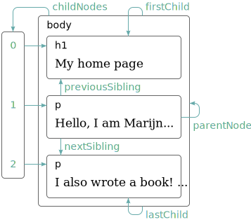

### JavaScript and the Browser

- In HTML, an ampersand `(&)` character followed by a word and a semicolon `(;)` is called an entity, and will be replaced by the character it encodes.
- A script tag must always be closed with `</script>`, even if it refers to a script file and doesn’t contain any code. If you forget this, the rest of the page will be interpreted as part of the script.\

### Document Object Model

- The global variable `document` gives us access to these objects. Its `documentElement` property refers to the object representing the `<html>` tag.
- Regular elements have the value `1`, which is also defined as the constant property `document.ELEMENT_NODE`. Text nodes, have the value 3 (`document.TEXT_NODE`). Comments have the value 8 (`document.COMMENT_NODE`).

### Moving through the tree



- The following recursive function scans a document for text nodes containing a given string and returns true when it has found one:

```javascript
function talksAbout(node, string) {
  if (node.nodeType == document.ELEMENT_NODE) {
    for (var i = 0; i < node.childNodes.length; i++) {
      if (talksAbout(node.childNodes[i], string)) return true;
    }
    return false;
  } else if (node.nodeType == document.TEXT_NODE) {
    return node.nodeValue.indexOf(String) > -1;
  }
}

console.log(talksAbout(document.body, "book"));
```

- The `offsetWidth` and `offsetHeight` properties give you the space the element takes up in pixels.
- `clientWidth` and `clientHeight` give you the size of the space inside the element, ignoring border width
- `getBoundingClientRect` returns an object with `top`, `bottom`, `left`, and `right` properties, indicating the pixel positions of the sides of the element relative to the top left of the screen.
- If you want them relative to the whole document, you must add the current **scroll position**, found under the global pageXOffset and pageYOffset variables.
- When a program asks for the position or size of something by reading properties such as `offsetHeight` or calling `getBoundingClientRect`, providing correct information also requires computing a layout.
- The notation `p > a {…}` applies the given styles to all `<a>` tags that are direct children of `<p>` tags.
- `p a {…}` applies to all `<a>` tags inside `<p>` tags, whether they are direct or indirect children.
- Unlike methods such as `getElementsByTagName`, the object returned by `querySelectorAll` is not live. It won’t change when you change the document.
- The `querySelector` method returns only the first matching element or null if no elements match.
